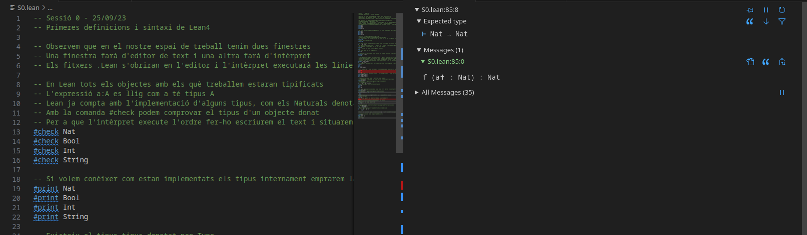
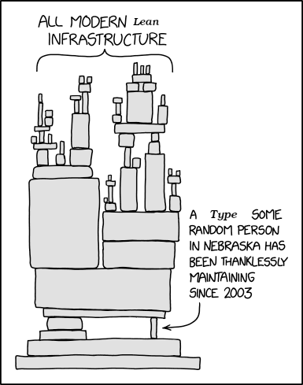
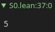
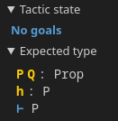

# Notes de Lean

Aquestes notes van ser redactades amb la intenció de tenir unes notes pel curs donat pel professor Enric Cosme Llópez sobre el llenguatge de demostració automàtica Lean.
(_També és una excusa per practicar el meu valencià_).

Quan estem usant Lean a Visual Studio code, la finestra estarà dividida en dues parts: el codi a l'esquerra i l'intèrpret a la dreta.
L'intèrpret ens dirà en cada pas quines coses tenim provades i quines coses resten per provar per a finalitzar un teorema.
També podem usar l'intèrpret per a visualitzar els tipus d'una variable i avaluar funcions (usant una sintaxi tipus notació polonesa com per eixample els llenguatges Lisp).



## Definicions i sintaxi

### Tipus
Lean és un llenguatge _tipat fort_ (així com a C o Haskell), el que significa que hem d'assignar un tipus a totes les variables que volem declarar.
Alguns del tipus que tenim per defecte són:
* `Nat`: els nombres naturals;
* `Bool`: per a variables booleans, és a dir que només admeten verdader o fals;
* `Int`: els nombres enters;
* `String`: una cadena de caràcters (com a paraules).
    
També podem escriure comandes de LaTeX com '\N' i '\Z', que es convertiran en símbols quan pressionem la tecla d'espai.
Altres símbols que funcionen són `\times`, `\cap`, `\to`...

Si usem la comanda '#check' en algú d'aquests tipus, Lean ens dirà que són tipus.


També podem veure una explicació de com estén implementats aquests tipus utilitzant la comanda '#print'.


Aquestes instruccions han de resultar familiars per a aquells que van llegir el llibre morat d'Abelson i Sussman, també conegut com el llibre amb els dos bruixots, el llibre amb la lambda, i molt ocasionalment "L'Estructura i Interpretació de Programes de Computació".
L'explicació curta (i tècnica) és que Lean (així com Haskell, Lisp i qualsevol altre llenguatge funcional) estan dissenyats com les matemàtiques, tenint un nombre de _construccions fonamentals_ que usem per a implementar altres construccions.



(Vinyeta original de [XKCD](https://xkcd.com/)).

### Variables i espais de treball
La sintaxi per a definir una variable és

```
def Variable : Tipus := Valor
``````

Per eixample, `x : Nat := 5` és el nombre `x=5`. 
odem veure el tipus de `x` usant `#check` i com està implementat mitjaçant `#print`.
Però més a més, també podem avaluar `x` utilitzant la comanda `#eval`:



També podem definir un espai de treball, similar a com el codi en C es va dividir en funcions dins un fitxer `.c`.
Aquest és un eixample d'un espai de treball.

```
namespace EspaiTreball
def r : Nat := 27
-- Notem que la variable r està perfectament definida dins l'espai de treball
#check r
#eval r 
#print r
end EspaiTreball
```

Notem l'ús de doble guió per escriure comentaris.
Cap variable definida fora d'aquest espai de treball serà reconeguda dins l'espai; similarment, qualsevol variable definida dins l'espai només funciona dins l'espai.
Per accedir a la variable `x` dins l'espai `space` usem la sintaxi `space.x`.

Per a definir una variable globalment, usam la comanda `variable` en comptes.
És a dir,

```
variable Variable : Tipus := Valor
```

També podem declarar múltiples variables usant la sintaxi `(var1 var2 : Tipus)`, amb dues `def` i `variable`.

### Aplicacions
Les aplicacions es declaren com un tipus `Tipus1 \to Tipus2`.
En aquest cas, la notació esdevé molt natural, perquè si escrivim `f: \Z \to \Z` tenim una funció que toma nombres enters i ens retorna nombres enters!
Per eixample,
```
def f: Nat → Nat := by 
  intro x
  exact x + 5
```
Aquesta sintaxi és la mateixa que el codi C
```
int f(x) { return x + 5; }
```
La comanda `intro` és el equivalent de dir "siga `x` un nombre natural", i `exact` és com la comanda `return`.
Per avaluar, escrivim
```
#eval f x               -- f(x)
#eval f (f x)           -- f(f(x)) (notació polanesa)
#eval (f\circ f) (x)    -- (f\circ f)(x)
```

## Treballem amb Proposicions
Per a declarar una proposició, utilitzem el tipus `Prop`.
Per eixample, escrivint `variable (P: Prop)` podem declarar una variable global de tipus Prop (una proposició global).

Donades proposicions `P` i `Q`, podem definir noves proposicions usant connectors:
* Conjunció `\and`
* Disjunció `\or`
* Negació `\not`
* Implicació `\to`
* Doble implicació `\iff`
* Veritat `True`
* Falsetat `False`
* * No confondre amb `false`, que té tipus `Bool`!
  
Per a provar un teorema, fem l'ús de la comanda `theorem` de la manera següent:
```
theorem TeoShow (h : P) : P :=
  show P from h
```
Hi ha una altra manera de provar aquest resultat, fent l'ús de comandes tàctiques o _tactics_. El teorema `TeoShow` pot ser provar usant tàctiques mitjançant les instruccions `by` i `exact`:
```
theorem TeoShow (h : P) : P := by
  exact h
```
Ara tenim un nou missatge qui llegeixes "no goals".
Les comandes tàctiques dividien la demostració d'un teorema en _metes_ qui volem aconseguir.
Per tant, una vegada arribem a l'estat de _no metes_, hem finalitzat la demostració!



Quan escrivim un teorema que no està acabar, podem escriure la comanda `sorry` de manera que el compilador no ens cride per tenir un error.
Si no escrivim `sorry`, Lean ens tornarà el següent missatge:


Podem emprar un teorema ja provar dins la demostració d'un altre teorema:
```
theorem Teo4 (h : P) : P := by
  exact (Teo2 P) h
```
Podem dividir una demostració en passos mitjançant la instrucció 'have':
```
theorem Teo5 (h : P) : P := by 
  have h' : P := by exact h 
  exact h'
```
Una altra comanda útil és `example`, qui actúa com un teorema anónim, així que no podem cridar-ho més tard
```
example (h : P) : P := by
  exact h
```

### Introducció i eliminació

